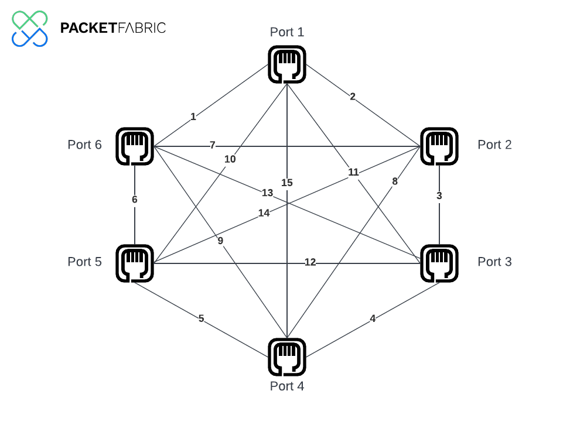

# Use Case: 

This use case shows an example on how to use the PacketFabric Terraform provider 
to automate the creation of a mesh of Backbone Virtual Circuits between 6 ports.



## Useful links

- [PacketFabric Terraform Docs](https://docs.packetfabric.com/api/terraform/)
- [PacketFabric Terraform Provider](https://registry.terraform.io/providers/PacketFabric/packetfabric)
- [HashiCorp Random Terraform Provider](https://registry.terraform.io/providers/hashicorp/random)

## Terraform resources deployed

- "random_pet"
- "packetfabric_backbone_virtual_circuit"

## Before you begin

- Before you begin we recommend you read about the [Terraform basics](https://www.terraform.io/intro)
- Don't have a PacketFabric Account? [Get Started](https://docs.packetfabric.com/intro/)

## Prerequisites

Ensure you have installed the following prerequisites:

- [Git](https://git-scm.com/downloads)
- [Terraform](https://learn.hashicorp.com/tutorials/terraform/install-cli)

Ensure you have the following items available:

- [Packet Fabric Billing Account](https://docs.packetfabric.com/api/examples/account_uuid/)
- [PacketFabric API key](https://docs.packetfabric.com/admin/my_account/keys/)

## Quick start

1. Set the PacketFabric API key and Account ID in your terminal as environment variables.

```sh
export PF_TOKEN="secret"
export PF_ACCOUNT_ID="123456789"
```

Windows PowerShell:
```powershell
PS C:\> $Env:PF_TOKEN="secret"
PS C:\> $Env:PF_ACCOUNT_ID="123456789"
```

2. Initialize Terraform, create an execution plan and execute the plan.

```sh
terraform init
terraform plan
```

**Note:** you can update terraform variables in the ``variables.tf``.

3. Apply the plan:

```sh
terraform apply
```

4. Destroy all remote objects managed by the Terraform configuration.

```sh
terraform destroy
```
