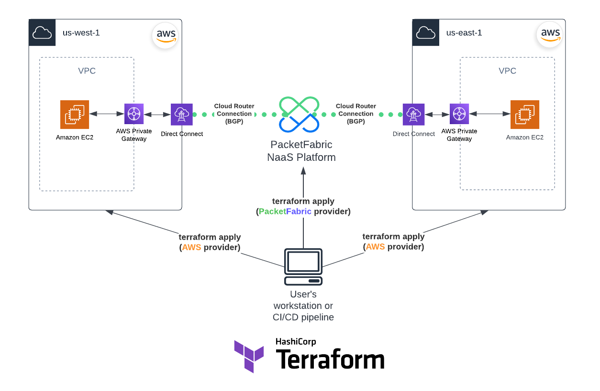
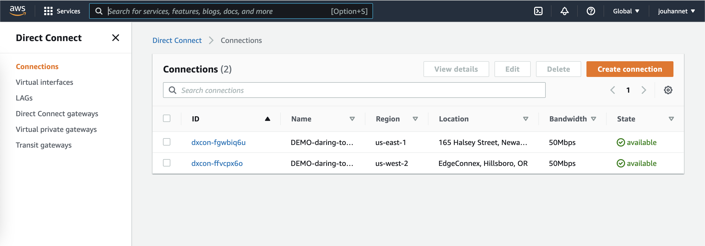
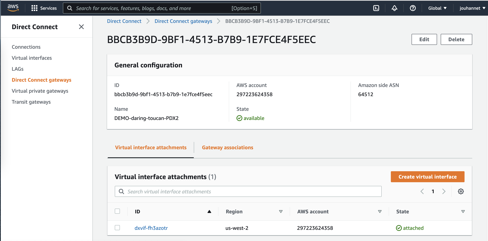
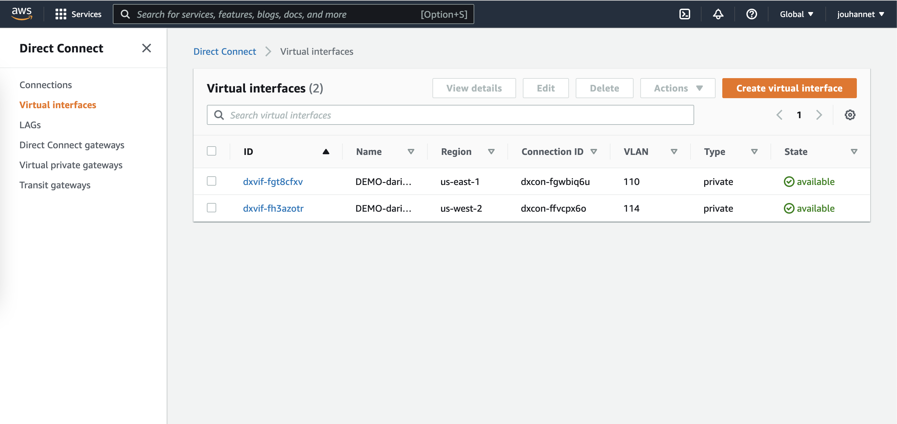
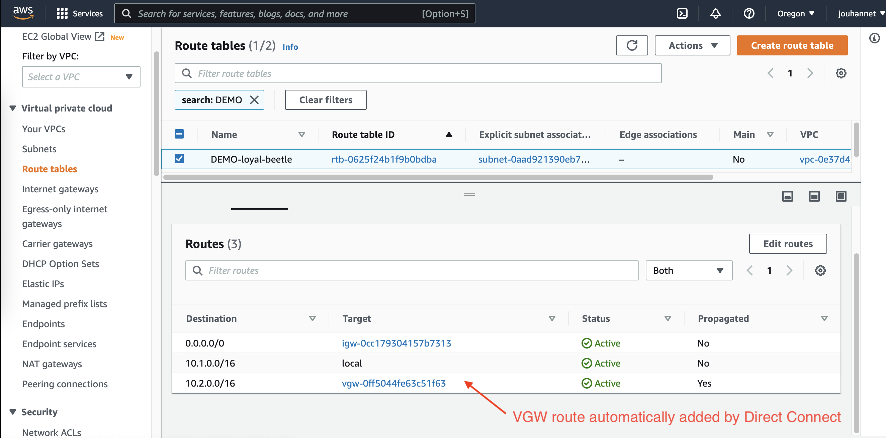
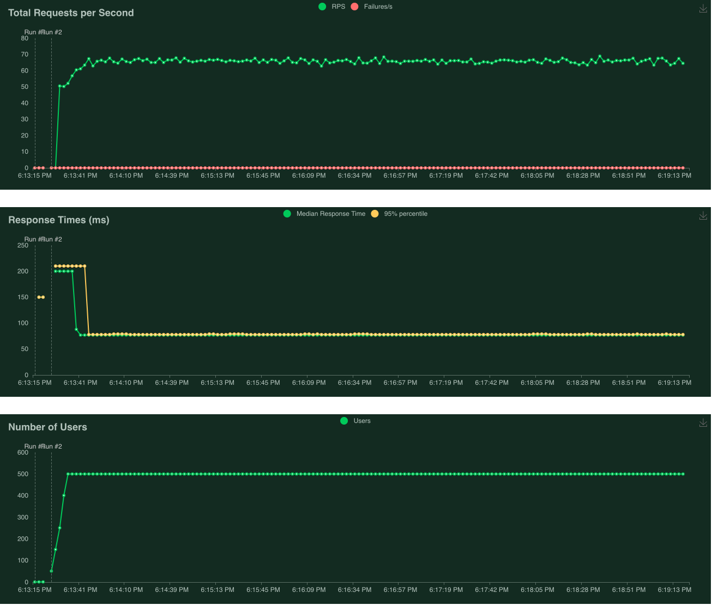

# Use Case: PacketFabric Cloud Router with AWS

This use case builds a connection between two AWS regions using the PacketFabric Cloud Router.
Terraform providers used: PacketFabric and AWS. This example uses AWS Private VIF & Gateway.



## Useful links

- [PacketFabric Terraform Docs](https://docs.packetfabric.com/api/terraform/)
- [PacketFabric Cloud Router Docs](https://docs.packetfabric.com/cr/)
- [PacketFabric Terraform Provider](https://registry.terraform.io/providers/PacketFabric/packetfabric)
- [HashiCorp AWS Terraform Provider](https://registry.terraform.io/providers/hashicorp/aws)
- [HashiCorp Random Terraform Provider](https://registry.terraform.io/providers/hashicorp/random)

## Terraform resources deployed

- "aws_dx_gateway"
- "aws_dx_private_virtual_interface"
- "aws_dx_gateway_association"
- "aws_security_group"
- "aws_network_interface"
- "aws_key_pair"
- "aws_instance"
- "aws_eip"
- "aws_vpn_gateway"
- "aws_vpn_gateway_attachment"
- "aws_route_table"
- "aws_vpc"
- "aws_subnet"
- "aws_internet_gateway"
- "aws_route_table_association"
- "packetfabric_cloud_router"
- "packetfabric_cloud_router_connection_aws"
- "time_sleep"
- "aws_dx_connection_confirmation"
- "packetfabric_cloud_router_bgp_session"
- "random_pet"

**Estimated time:** ~15 min for AWS & PacketFabric resources + ~10-15 min for AWS Direct Connect Gateway association with AWS Virtual Private Gateways

**Note**: Make sure you set the correct AWS region based on the PacketFabric pop selected (find details on location [here](https://packetfabric.com/locations/cloud-on-ramps) and [here](https://aws.amazon.com/directconnect/locations/). Essentially, select the PacketFabric pop the closest to the AWS region you want to connect to. Example: AWS region ``us-west-1`` is the closest to PacketFabric pop ``LAX1``.

## Before You Begin

- Before you begin we recommend you read about the [Terraform basics](https://www.terraform.io/intro)
- Don't have a PacketFabric Account? [Get Started](https://docs.packetfabric.com/intro/)
- Don't have an AWS Account? [Get Started](https://aws.amazon.com/free/)
    - Permissions required: VPC, EC2, Direct Connect

## Prerequisites

Make sure you have installed all of the following prerequisites on your machine:

- [Git](https://git-scm.com/downloads)
- [Terraform](https://learn.hashicorp.com/tutorials/terraform/install-cli)

Make sure you have the following items available:

- [AWS Account ID](https://docs.aws.amazon.com/IAM/latest/UserGuide/console_account-alias.html)
- [AWS Access and Secret Keys](https://docs.aws.amazon.com/general/latest/gr/aws-security-credentials.html)
- [Packet Fabric Billing Account](https://docs.packetfabric.com/api/examples/account_uuid/)
- [PacketFabric API key](https://docs.packetfabric.com/admin/my_account/keys/)
- [SSH Public Key](https://www.ssh.com/academy/ssh/keygen)

## Quick Start

1. Create the file ``secret.tfvars`` and update each variables as needed (edit ``variables.tf``).

```sh
cp secret.tfvars.sample secret.tfvars
```

2. Initialize Terraform, create an execution plan and execute the plan.

```sh
terraform init
terraform plan -var-file="secret.tfvars"
```

Apply the plan:

```sh
terraform apply -var-file="secret.tfvars"
```

3. Either use and [locust](https://locust.io/) or [iperf3](https://github.com/esnet/iperf) to simulate traffic between the 2 EC2 instances in the 2 AWS regions.

- iperf3: (replace ``<ec2_private_ip_2>`` with the EC2 private IP from instance 2)

    - Server side (on instance 1): ``iperf3 -s -p 5001``
    - Client side (on instance 2): ``iperf3 -c <ec2_private_ip_1> -p 5001``

- locust: (replace ``<ec2_public_ip_1>`` with the EC2 public IP)

In a browser, on instance 1), open ``http://<ec2_public_ip_1>:8089/``, then update the host with the correct IP (using `` <ec2_private_ip_2>`` from instance 2), set the number of users to ``500`` and spawn rate to ``50``.

If you want to use iperf3, open a ssh session using the user ``ubuntu`` and the ssh private key linked to the public key you specified in the ``secret.tfvars`` file.

4. Destroy all remote objects managed by the Terraform configuration.

```sh
terraform destroy -var-file="secret.tfvars"
```

**Note:** Default login/password for Locust is ``demo:packetfabric`` edit ``user-data-ubuntu.sh`` script to change it.

## Troubleshooting

In case you get the following error:

```
╷
│ Error: error waiting for Direct Connection Connection (dxcon-fgq3o1ff) confirm: timeout while waiting for state to become 'available' (last state: 'pending', timeout: 10m0s)
│ 
│   with aws_dx_connection_confirmation.confirmation_2,
│   on cloud_router_connections.tf line 80, in resource "aws_dx_connection_confirmation" "confirmation_2":
│  80: resource "aws_dx_connection_confirmation" "confirmation_2" {
│ 
```

You are hitting a timeout issue in AWS [aws_dx_connection_confirmation](https://registry.terraform.io/providers/hashicorp/aws/latest/docs/resources/dx_connection_confirmation) resource. Please [vote](https://github.com/hashicorp/terraform-provider-aws/issues/26335) for this issue on GitHub.

As a workaround, edit the `cloud_router_connections.tf` and comment out the following resource:

```
# resource "aws_dx_connection_confirmation" "confirmation_2" {
#   provider      = aws.region2
#   connection_id = data.aws_dx_connection.current_2.id
# }
```

Edit the `aws_dx_private_vif.tf` and comment out the dependency with `confirmation_2` in `packetfabric_cloud_router_connection_aws` data source: 

```
data "packetfabric_cloud_router_connections" "current" {
  provider   = packetfabric
  circuit_id = packetfabric_cloud_router.cr.id

  depends_on = [
    aws_dx_connection_confirmation.confirmation_1,
    # aws_dx_connection_confirmation.confirmation_2,
  ]
}
```

Then remove the `confirmation_2` state, check the Direct Connect connection is **available** and re-apply the terraform plan:
```
terraform state rm aws_dx_connection_confirmation.confirmation_2
terraform apply -var-file="secret.tfvars"
```

## Screenshots

Example AWS Direct Connect Connections:



Example AWS Direct Connect gateway:



Example Direct Connect Private Virtual interfaces:



Example AWS VPC Routing Table:



Traffic Generator using Locust: *Response Time ~77ms*


