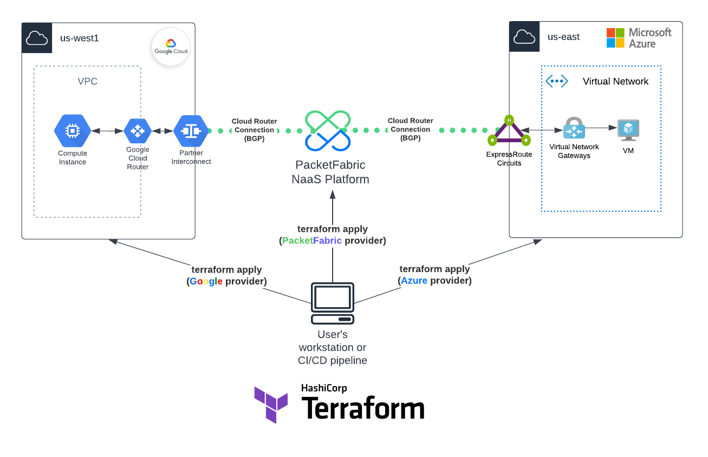
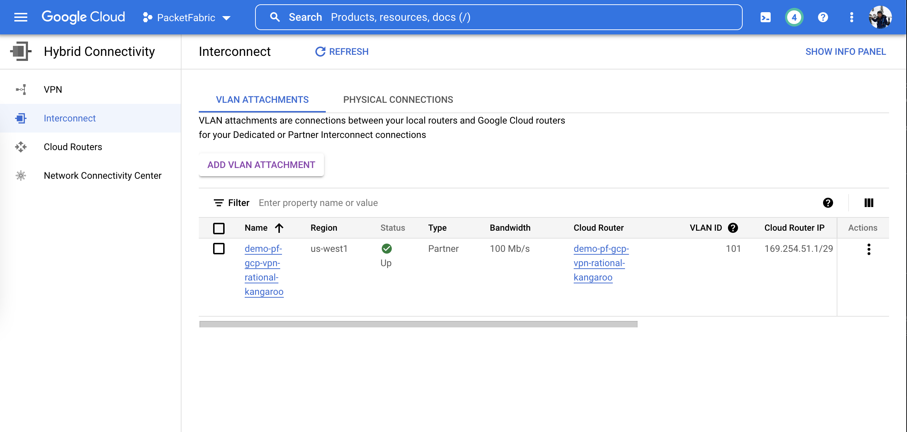

# Use Case: PacketFabric Cloud Router with Google and Azure

This use case builds a PacketFabric Cloud Router between Google Cloud Platform and Microsoft Azure Cloud.
Terraform providers used: PacketFabric, Azure and Google.



## Useful links

- [PacketFabric Terraform Docs](https://docs.packetfabric.com/api/terraform/)
- [PacketFabric Cloud Router Docs](https://docs.packetfabric.com/cr/)
- [PacketFabric Terraform Provider](https://registry.terraform.io/providers/PacketFabric/packetfabric)
- [HashiCorp Google Terraform Provider](https://registry.terraform.io/providers/hashicorp/google)
- [HashiCorp Microsoft Azure Terraform Provider](https://registry.terraform.io/providers/hashicorp/azurerm)
- [HashiCorp Random Terraform Provider](https://registry.terraform.io/providers/hashicorp/random)

## Terraform resources deployed

> **Warning**: Microsoft begins billing as soon as the service key is created, which is why we advise that you wait until your cross connect is established first.

- "azurerm_resource_group"
- "azurerm_virtual_network"
- "azurerm_subnet"
- "azurerm_network_security_group"
- "azurerm_public_ip"
- "azurerm_network_interface"
- "azurerm_network_interface_security_group_association"
- "azurerm_ssh_public_key"
- "azurerm_virtual_machine"
- "packetfabric_cloud_router"
- "azurerm_express_route_circuit"
- "packetfabric_cloud_router_connection_azure"
- "azurerm_express_route_circuit_peering"
- "azurerm_public_ip"
- "google_compute_router"
- "google_compute_interconnect_attachment"
- "packetfabric_cloud_router_connection_google"
- "packetfabric_cloud_router_bgp_session"
- "google_compute_firewall"
- "google_compute_instance"
- "google_compute_network"
- "google_compute_subnetwork"
- "random_pet"

**Estimated time:** ~10 min for Google, Azure & PacketFabric resources + up to 50 min for Azure Virtual Network Gateway (deletion up to 12min)

**Note**: Because the BGP session is created automatically, we use gcloud terraform module to retreive the BGP addresses and set the PacketFabric Cloud Router ASN in the BGP settings in the Google Cloud Router. Please [vote](https://github.com/hashicorp/terraform-provider-google/issues/11458), [vote](https://github.com/hashicorp/terraform-provider-google/issues/12624) and [vote](https://github.com/hashicorp/terraform-provider-google/issues/12630) for these issues on GitHub.

## Before You Begin

- Before you begin we recommend you read about the [Terraform basics](https://www.terraform.io/intro)
- Don't have a PacketFabric Account? [Get Started](https://docs.packetfabric.com/intro/)
- Don't have an Google Account? [Get Started](https://cloud.google.com/free)
- Don't have an Azure Account? [Get Started](https://azure.microsoft.com/en-us/free/)

## Prerequisites

Make sure you have installed all of the following prerequisites on your machine:

- [Git](https://git-scm.com/downloads)
- [Terraform](https://learn.hashicorp.com/tutorials/terraform/install-cli)
- [gcloud](https://registry.terraform.io/modules/terraform-google-modules/gcloud/google/latest)
- [jq](https://stedolan.github.io/jq/download/)

Make sure you have the following items available:

- [Google Service Account](https://cloud.google.com/compute/docs/access/create-enable-service-accounts-for-instances)
- [Microsoft Azure Credentials](https://docs.microsoft.com/en-us/azure/developer/terraform/authenticate-to-azure?tabs=bash)
- [Packet Fabric Billing Account](https://docs.packetfabric.com/api/examples/account_uuid/)
- [PacketFabric API key](https://docs.packetfabric.com/admin/my_account/keys/)

## Quick Start

1. Set PacketFabric API key and Account ID in environment variables and update each variables as needed (edit ``variables.tf``).

```sh
export PF_TOKEN="secret"
export PF_ACCOUNT_ID="123456789"
```

Set additional environment variables for Azure and Google:

```sh
### Azure
export ARM_CLIENT_ID="00000000-0000-0000-0000-000000000000"
export ARM_CLIENT_SECRET="00000000-0000-0000-0000-000000000000"
export ARM_SUBSCRIPTION_ID="00000000-0000-0000-0000-000000000000"
export ARM_TENANT_ID="00000000-0000-0000-0000-000000000000"

### Google
export TF_VAR_gcp_project_id="my-project-id"
export TF_VAR_gcp_credentials_path="/Users/myuser/secret.json"

export TF_VAR_public_key="ssh-rsa AAAA...= user@mac.lan"
```

2. Initialize Terraform, create an execution plan and execute the plan.

```sh
terraform init
terraform plan
```

Apply the plan:

```sh
terraform apply
```

3. Destroy all remote objects managed by the Terraform configuration.

```sh
terraform destroy
```

**Note:** Default login/password for Locust is ``demo:packetfabric`` edit ``user-data-ubuntu.sh`` script to change it.

## Troubleshooting

1. In case you get the following error:

```
╷
│ Error: Error when reading or editing InterconnectAttachment: googleapi: Error 400: The resource 'projects/prefab-setting-123456/regions/us-west1/interconnectAttachments/demo-pf-gcp-vpn-master-cricket' is not ready, resourceNotReady
│ 
│ 
```

This seems to be a problem with Google Terraform Provider, run again the terraform destroy command and the destroy will complete correctly the 2nd try.
Please [vote](https://github.com/hashicorp/terraform-provider-google/issues/12631) for this issue on GitHub.

2. In case the ``gcloud_bgp_address`` module fails, check the error, fix it and manually remove the state before re-running the terraform config.

```sh
terraform state rm module.gcloud_bgp_addresses
terraform state rm module.gcloud_bgp_peer_update
```

## Screenshots

Example Google Interconnect (VLAN attachment) in Google Cloud Console:



Example an Azure ExpressRoute in Azure:


